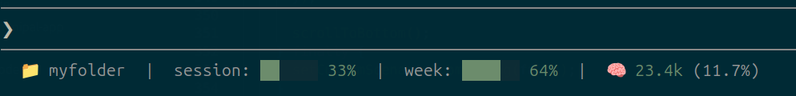

# claude-status

Minimal status line for [Claude Code](https://docs.claude.com/en/docs/claude-code) showing folder, 5-hour usage, weekly usage, and context window consumption with colored progress bars.

Works on Linux and Mac. Context window set to 200k on purpose as LLMs get dumber with too many tokens.



## Install

1. Install `jq` (required):
   - macOS: `brew install jq`
   - Debian/Ubuntu: `sudo apt install jq`
   - Arch: `sudo pacman -S jq`

2. Place the script:
   ```bash
   curl -o ~/.claude/statusline.sh https://raw.githubusercontent.com/Rffrench/claude-status/refs/heads/master/statusline.sh
   chmod +x ~/.claude/statusline.sh
   ```

3. Add to `~/.claude/settings.json`:
   ```json
   {
     "statusLine": {
       "type": "command",
       "command": "~/.claude/statusline.sh"
     }
   }
   ```

## Output

```
📁 my-project  |  session: ███▌░░ 58%  |  week: ██░░░░ 32%  |  🧠 145.2k (72.6%)
```

- **session** - 5-hour rate limit usage
- **week** - 7-day rate limit usage
- **🧠** - current context window usage (assumes 200k window)

Bars turn red at ≥85%.

## Configuration

Edit constants near the top of `statusline.sh`:

| Variable | Default | Purpose |
|----------|---------|---------|
| `CTX_WINDOW` | `200000` | Context window size in tokens |
| `BAR_WIDTH` | `6` | Bar width in characters |

Colors use 256-color ANSI codes — adjust `GREEN`, `RED`, `TRACK`, `DIM` to taste.

## Limitations

- **No native Windows support.** Requires WSL, Git Bash, or Cygwin (uses `#!/bin/bash`).
- **Requires `jq`.** Not preinstalled on macOS or most Linux distros.
- **Terminal must support 256-color ANSI** and render Unicode block characters (`█ ▌ ░`) plus emoji.
- **Context window is hardcoded to 200k.** Change `CTX_WINDOW` if your model differs.
- **Context value reflects the last assistant turn only**, not a running max - drops after compaction.
- **Rate limit fields may be empty** on plans without 5h/weekly limits; bars render as `—`.

## License

MIT
